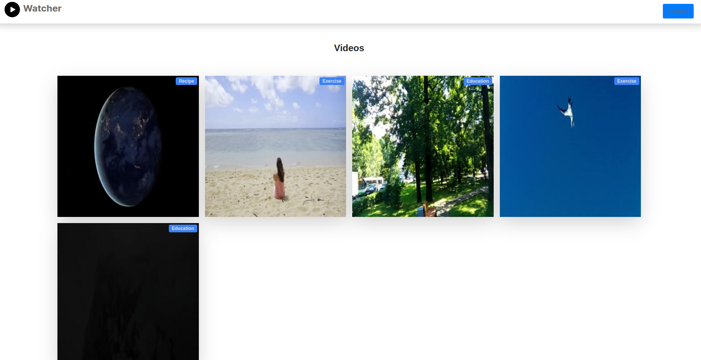
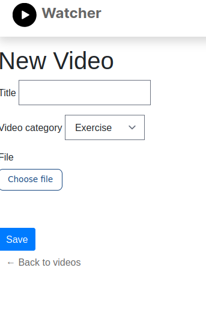

# Watcher

This repository contains the code for a demo application that grants users the ability to store, then play uploaded videos.

---





---

## Installation

The app can be ran standalone, as well as on Docker.

#### Run the app locally
./bin/webpack-dev-server
rails server

Below, the rest of this guide provides instructions for usage on Docker.
You need:

- `docker` and `docker-compose` installed.
- [`dip`](https://github.com/bibendi/dip) installed.

Run the following command to build images and provision the application:
```sh
dip provision
```

## Running the app
You can start Rails server by running:
```sh
dip up
```
Then go to [http://localhost:3000/](http://localhost:3000/) and see the application in action.

**Note**: If you're too fast, you might experience some lag on first request.
This is normal, as webpacker is compilling the assets.
Once the compilation is finished, you should be good to go!

## Debugging

If you want to run the Rails console, run the following command:

```sh
dip rails c
```

## Testing

You can run the tests with:

```sh
dip rspec
```

## Used Technologies

- Jquery -> as a JS framework
- TailwindCSS -> utility-first CSS framework
- Bootstrap -> to beautify some UI elements (in lack of time)
- Docker and Docker compose -> as an application wrapper
- Ruby 3.0.2
- Ruby on Rails 6.1.4 having the following libraries:
* Rspec - as a test framework
* SuckerPunch - as the async job handler
* and more..

## Acknowledgments

Built and tested with the help of some of these awesome technologies from Tailwind:
- [Tailwind CSS](https://tailwindcss.com)
- [Tailwind Play](https://play.tailwindcss.com/)

---

### Background story

Coding challenge with fixed constraints.

Crude solution was made to instruct Shrine to process video thumbnails on demand.
With more time, I would have let SuckerPunch/Sidekiq to them asynchronously.
Then, in the UI, the user would see an image showing that it's processing.
This image would be connected through ActionCable -> Turbo to the app.
When all related background job finished, the image is replaced with the 256x256 thumbnail.
The user can then continue using the app as it would normally.

#### Constraint

TODO

## License

The application is available as open source under the terms of the [MIT License](http://opensource.org/licenses/MIT).
